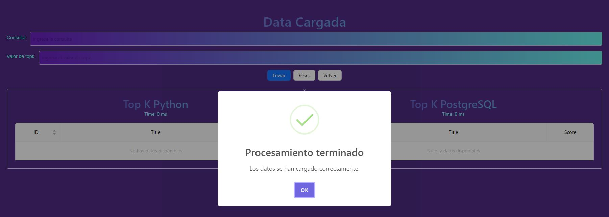
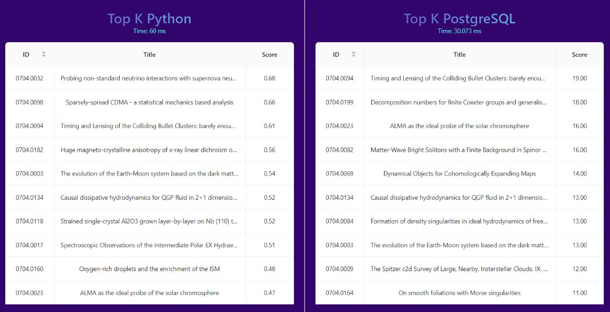

# BD2-Proyecto 2

Proyecto de Base de Datos 2: Recuperación de Documentos de Texto

## Integrantes:
    - Canto Vidal, Harold Alexis
    - Gutierrez Soto, Brhandon Luis
    - Rincón Espinoza, Alberto Domenic


# Tabla de contenido
- [Objetivo](#Objetivo)
- [Cuadro de Actividades](#Cuadro-de-Actividades)
- [Descripción del dominio de datos](#Descripción-del-dominio-de-datos)
- [Backend](#Backend)
  * [Construcción del índice invertido](#Construcción-del-índice-invertido)
  * [Manejo de memoria secundaria](#Manejo-de-memoria-secundaria)
  * [Ejecución optima de consultas](#Ejecución-optima-de-consultas)
- [Frontend](#Frontend)
  * [Diseño del índice con PostgreSQL](#Diseño-del-índice-con-PostgreSQL)
  * [Análisis comparativo](#Análisis-comparativo)
  * [Screenshots de la GUI](#Screenshots-de-la-GUI)

## Objetivo

  Entender y aplicar los algoritmos de búsqueda y recuperación de la información basado en el contenido.
## Cuadro de Actividades:

<table>
  <tbody>
    <tr>
      <th>Lista de actividades realizadas</th>
      <th align="center">Responsable</th>
    </tr>
    <td>Backend</td>
      <td align="center">Alberto Rincón y Brhandon Gutierrez</td>
    </tr>
    <tr>
    <tr>
      <td>Frontend</td>
      <td align="center">Harold Canto Vidal</td>
    </tr>
    <tr>
      <td>Elaboración del informe</td>
      <td align="center">Brhandon Gutierrez</td>
    </tr>
  </tbody>
</table>

## Descripcion del dominio de datos

arXiv es un archivo en línea para las prepublicaciones de artículos científicos en el campo de las matemáticas, física, ciencias de la computación y biología cuantitativa.

Este conjunto de datos es un espejo de la data original de ArXiv. Debido a que el conjunto de datos completo es bastante grande (1,1 TB y sigue creciendo), este conjunto de datos solo proporciona un archivo de metadatos en formato json. Este archivo contiene una entrada para cada papel, que contiene:

* **id**: ArXiv ID 
* **submitter**: Quién envió el papel
* **authors**: Autores del papel
* **title**: Título del artículo
* **comments**: Información adicional, como número de páginas y figuras
* **journal-ref**: Información sobre la revista en la que se publicó el artículo
* **doi**: Digital Object Identifier
* **abstract**: El resumen del papel
* **categories**: Categorías / etiquetas en el sistema ArXiv
* **versions**: Un historial de versiones

## Backend

### Construcción del índice invertido


### Manejo de memoria secundaria


La carga de datos desde la memoria secundaria se realiza en el método load_data, que recibe una instancia de UBetterFixEverything y el número de documentos a leer.

```python
def load_data(instance, docs_to_read):    
    instance.BLOCK_SIZE = 7500
```

Luego, se carga el contenido de los documentos en la memoria secundaria utilizando el método load de la instancia de UBetterFixEverything. El método load no se proporciona en el código proporcionado, por lo que no es posible determinar los detalles específicos de cómo se realiza la carga de datos en la memoria secundaria.

```python
def load(self, MAX):
```

### Ejecución optima de consultas

 - Preprocesamiento de consultas
   ```python
    def preprocesamiento(self, texto):
        # tokenizar
        palabras = nltk.word_tokenize(texto.lower())

        try:
            # filtrar stopwords
            palabras_limpias = []
            for token in palabras:
                if token not in self.stoplist:
                    palabras_limpias.append(token)

            # reducir palabras
            stemmer = SnowballStemmer(language='english')
            
            return final_clean_words
    ```
 - Cálculo de puntuación de relevancia: Durante la ejecución de una consulta, se realiza el cálculo de la puntuación de relevancia para los documentos que coinciden con la consulta.
 - Tiempo de ejecución: Durante la ejecución de la consulta, se mide el tiempo necesario para obtener los resultados

## Frontend

### Diseño del índice con PostgreSQL

- Se establece una conexión con la base de datos PostgreSQL utilizando la biblioteca psycopg2.
- Se ejecutan consultas SQL para crear una tabla llamada json_to_pos en la base de datos, si no existe. Esta tabla se utiliza para almacenar los documentos en formato JSON que se cargarán en el índice invertido.
- Se abre un archivo que contiene los documentos a cargar en el índice.
- Se ejecuta una consulta SQL para insertar los valores extraídos en la tabla json_to_pos.
- Después de cargar los documentos en la tabla, se realizan los siguientes pasos para construir el índice invertido:
- Se agrega una nueva columna llamada search_txt a la tabla json_to_pos.
- Se actualiza la columna search_txt con los vectores de términos de los campos relevantes del documento, como el título y el contenido.
- Se crea un índice GIN en la columna search_txt para habilitar búsquedas rápidas y eficientes en el texto indexado.

### Análisis comparativo

### Screenshots de la GUI





